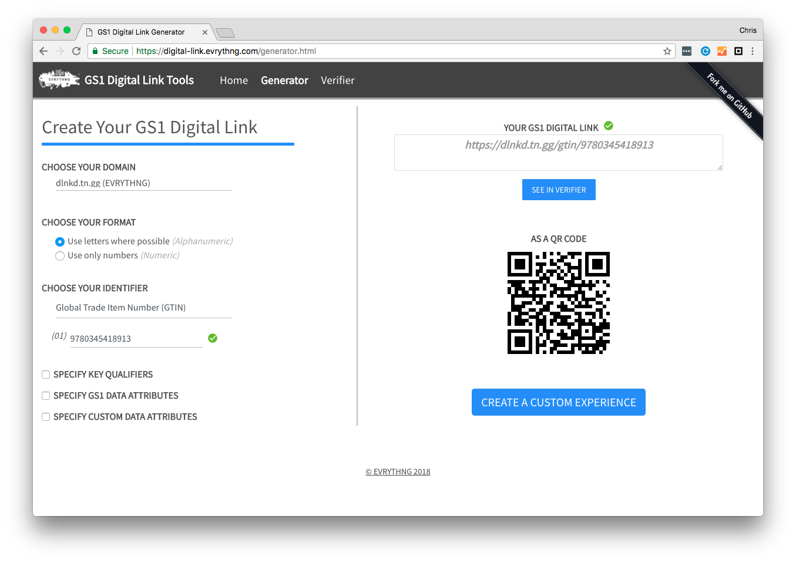
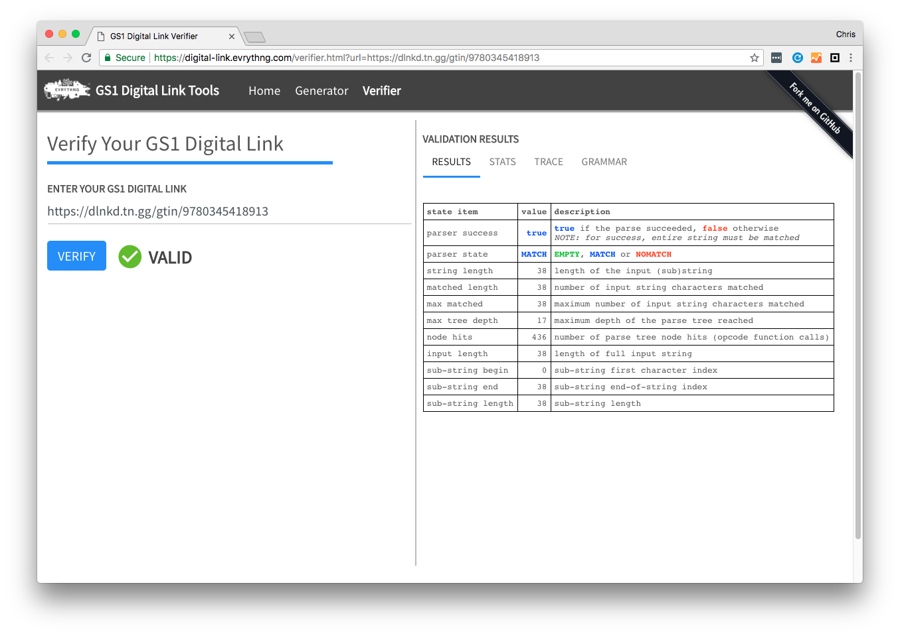

# GS1 Digital Link tools

This project provides a number of tools for the [GS1 Digital Link standard](https://evrythng.com/upgrading-the-barcode-to-the-web-gs1-digital-link/), the standard that upgrades the barcode to the Web! The tools offer an ideal playground to experiment with Digital Links with a JavaScript generator and a verifier.

The tool is also directly available on: https://digital-link.evrythng.com/

If you would like to use Digital Links for your brand in production and at scale do not hesistate to [contact us](https://evrythng.com/gs1/), the EVRYTHNG platform is the first commercial platform to support the Digital Link.

## Digital Link Generator

The generator allows you to create your own GS1 Digital Link using the following
elements:

* **Domain** - the domain of the resolver.
* **Format** - choose to use only numbers, or use alphanumeric aliases where 
  available. For example, `gtin` instead of `01`.
* **Identifier** - the main identifier of the Digital Link, such as GTIN.
* **Key Qualifiers** - any required key qualifiers, such as CPV or Serial.
* **GS1 Data Attributes** - any required GS1-defined data attributes, such as 
  best before date. The entire list can be browsed using a type-ahead seach box.
* **Custom Data Attributes** - any extra user-defined data attributes not 
  defined by the GS1 standard.

Once these data items have been entered, the completed GS1 Digital Link is 
visible on the right hand side, ready to be copied elsewhere. You can pass it 
straight to the verifier tool (see below), or copy/scan the equivalent QR code.

## Digital Link Verifier

The verifier tool uses the [`apglib`](https://github.com/ldthomas/apg-js2-lib) 
library to check a submitted GS1 Digital Link for formatting errors using the 
grammar as detailed in `src/scripts/grammar.js`. This grammar can also be viewed 
from the verifier page under the 'Grammar' tab. 

After the verifier has run on the submitted GS1 Digital Link, the results of 
the validation are visible on the right hand side, including statistics and 
validation trace entries from the `apglib` library itself.

## Development

The tools are HTML, CSS (Bootstrap and Flexbox), and JavaScript, 
and are compiled with [Parcel](https://parceljs.org/).

## Building

To build this project, perform the following steps:

1. Run `git clone` to clone this repository locally.
2. Run `npm i` to install the dependencies.
3. Run `npm run serve` to build and run a development server.

## Deploying

To deploy the project, perform the following steps:

1. Run `git clone` to clone this repository locally.
2. Run `npm run build` to generate site artifacts.
3. Deploy the generated `dist` folder to your hosting service of choice.
4. Go to `/index.html` to begin.
